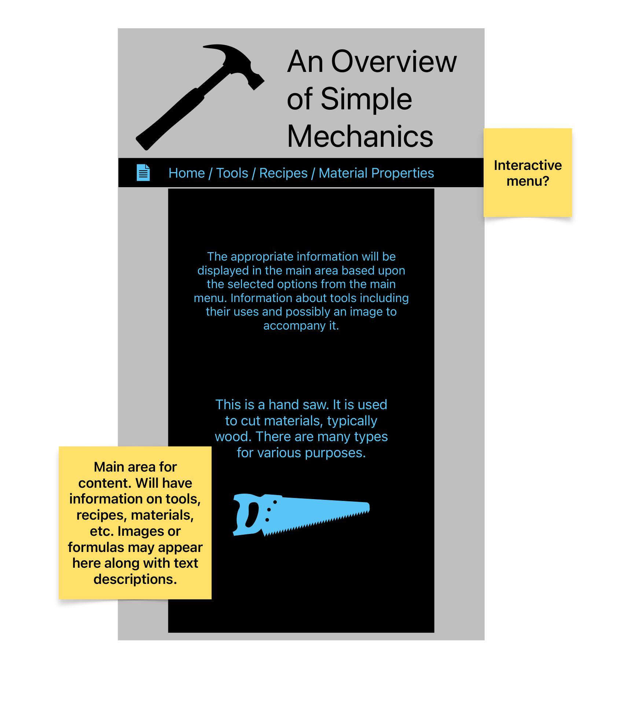

An Overview of Simple Mechanics
===============================
This project will parse through a book on practical mechanics and display a glossary of common
words used and their definitions.

Data Source:
------------
[Practical Mechanics for Boys](https://www.gutenberg.org/ebooks/22298)

Items of Interest:
------------------

- Glossary of words
- Word
- Definition of word

Proposed Layout:
----------------

